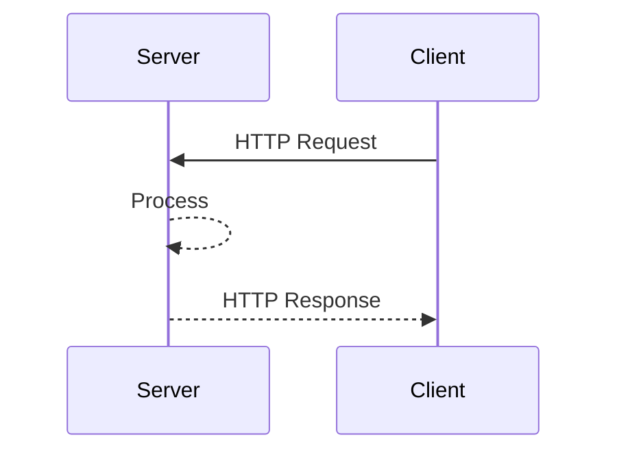
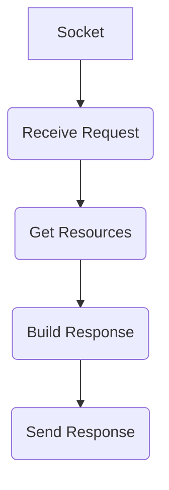
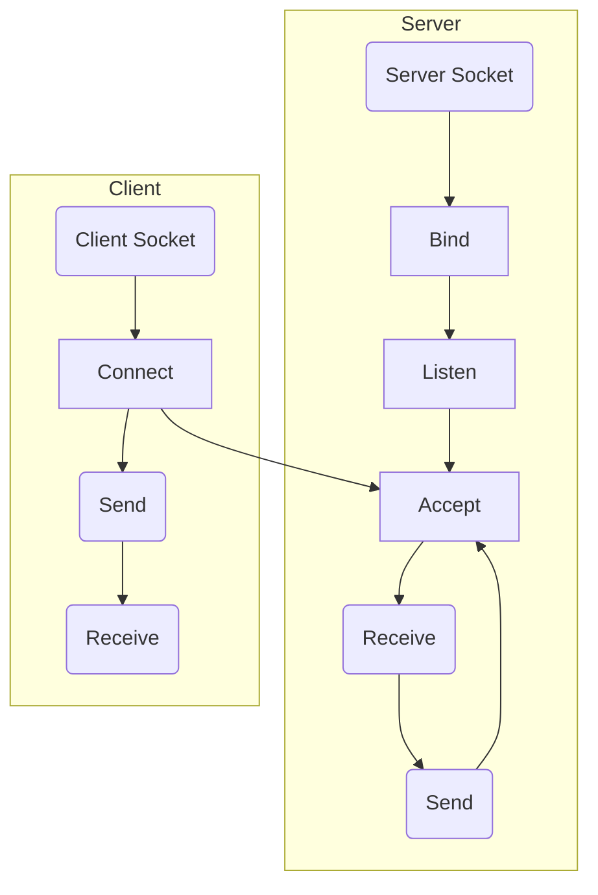

# 实验二 应用层实验 实验报告

|学院|班级|学号|姓名|指导教师|
|---|---|---|---|---|
|计算机科学与工程学院|计硕2109|2171960|徐文昊|刘铮|

本次实验选择实现一个简单的 Web Server.

-----

- [实验二 应用层实验 实验报告](#实验二-应用层实验-实验报告)
  - [简易多线程 HTTP 服务器](#简易多线程-http-服务器)
  - [功能展示](#功能展示)
    - [首页](#首页)
    - [子页面](#子页面)
  - [快速开始](#快速开始)
  - [实现思路](#实现思路)
    - [C/S 模型](#cs-模型)
    - [程序的输入与输出](#程序的输入与输出)
      - [HTTP Request](#http-request)
      - [HTTP Response](#http-response)
    - [处理过程](#处理过程)
      - [构造 Socket 并监听消息](#构造-socket-并监听消息)
      - [处理 HTTP Request 请求](#处理-http-request-请求)
        - [解析 HTTP 请求](#解析-http-请求)
        - [获取请求的资源文件](#获取请求的资源文件)
        - [构造 HTTP 响应报文](#构造-http-响应报文)
        - [发送响应报文](#发送响应报文)
  - [总结](#总结)

## 简易多线程 HTTP 服务器

本服务器功能特性如下。

- Using Socket in Python and file based
- 基于线程池的多线程
- 支持 HTTP GET 请求 (RFC 7231)
- 支持静态资源内容请求
- MIME 类型支持
- 支持 200, 206 和 404 HTTP Response Status Code
- 支持 HTTP GET 请求的单线程断点续传 (single Range HTTP GET Request, RFC 2616/RFC 7233)

## 功能展示

在 `./static_files/` 文件夹下放入由 Hexo 生成的纯静态网页后的效果。P.S. 你可以放入任何纯静态的网页内容.

### 首页

[](https://imgtu.com/i/IgiagU)

### 子页面

[](https://imgtu.com/i/IgiBDJ)

其效果与本人用 Ngnix 部署的个人网站等效，浏览请 [点击此处](https://www.xuwhao.top)。

## 快速开始

1. 安装 python2.7  
    自行安装. 如没有集成开发环境等也可自行安装，如 PyCharm.

2. 在 HTTP Server 目录下安装相关依赖

    ```shell
    pip install -r requirements.txt
    ```  

3. 启动服务器

    ```python
    # entry point is './run.py'
    python run.py
    ```

4. 在浏览器中打开对应网页

   - open url: <http://localhost:5555/test_1.txt>
   - open url: <http://localhost:5555/test_2.html>
   - open url: <http://localhost:5555/test_3.html>
   - open url: <http://localhost:5555/test_4.gif>
   - open url: <http://localhost:5555/test_5.mp4>

5. everything works?
  打开浏览器的开发者模式，观察本服务器的各种特性。

## 实现思路

### C/S 模型

Client/Server 模型的时序图如下。



从图中我们可以看出，实现一个 HTTP Server，需要监听并响应客户端的 HTTP 请求。

### 程序的输入与输出

一个程序总会有输入、处理与输出的过程。而作为一个 HTTP Server，输入自然就是 HTTP Request 请求报文，而输出就是 HTTP Response 响应报文。我们有必要了解这两个报文的细节，从而明确我们的处理过程究竟是一个什么逻辑。下面将先阐述两个报文的细节，以说明我们需要做的工作。

#### HTTP Request

一个 HTTP 请求报文由请求行（Request Line）、请求头部（Header）、空行(\<CR>\<LF>)和请求数据4个部分组成,请求数据不在 GET 方法中使用，而是在 POST 方法中使用。当 HTTP 请求报文携带请求数据时，必须在 Header 中指明 Content-Length。本服务器仅考虑实现 GET 请求。

下面是一则 HTTP GET 请求。

```http
GET /index.html HTTP/1.1
Host: localhost:5555
Connection: keep-alive
sec-ch-ua: "Google Chrome";v="95", "Chromium";v="95", ";Not A Brand";v="99"
sec-ch-ua-mobile: ?0
sec-ch-ua-platform: "Windows"
Upgrade-Insecure-Requests: 1
User-Agent: Mozilla/5.0 (Windows NT 10.0; Win64; x64) AppleWebKit/537.36 (KHTML, like Gecko) Chrome/95.0.4638.69 Safari/537.36
Accept: text/html,application/xhtml+xml,application/xml;q=0.9,image/avif,image/webp,image/apng,*/*;q=0.8,application/signed-exchange;v=b3;q=0.9
Sec-Fetch-Site: none
Sec-Fetch-Mode: navigate
Sec-Fetch-User: ?1
Sec-Fetch-Dest: document
Accept-Encoding: gzip, deflate, br
Accept-Language: zh-CN,zh;q=0.9
Cookie: _ga=GA1.1.1705856518.1631602913; Hm_lvt_0d04419c5b1bb2e0a76b92ec342502b4=1636898877; _gid=GA1.1.2017212840.1636898877; Hm_lpvt_0d04419c5b1bb2e0a76b92ec342502b4=1636906589
<CR><LF>
```

其中第一行是请求行，其中 "GET" 是请求方法，表示客户端以 GET 方式申请资源，GET 请求被认为是幂等的，即多次、连续发送的请求结果应一致。紧随其后的是资源 URI 与 HTTP 版本号。  
第二行开始都是 HTTP 请求的头部字段。  
在本服务器中，需要根据 HTTP GET 请求中的 Request URI 与 Header，来寻找正确的资源并进行处理，写入 HTTP Response 报文中返回给服务器端。

#### HTTP Response

HTTP Response 响应报文分为响应行，Header 响应头，空行和响应体 Body 组成。下面是一则 HTTP Response 响应报文。

```http
HTTP/1.1 206 Partial Content
Content-Length: 1155802
Content-type: video/mp4
Accept-Ranges: bytes
Content-Range: bytes 0-1155801/1155802
<CR><LF>
[Response Body for binary data]
```

其中第一行是响应行。第一个参数表明了 HTTP 协议的版本。随后的参数是 HTTP 状态码，206 代表 Partial Content. 其他的还有 200 OK，404 Not Found 等。随后一直到空行都是 Response Header. `Content-Length` 代表 Body 的 长度，`Content-type` 指出了资源的 MIME Type. `Accept-Ranges: bytes` 表示服务器支持 Partial Request. 本 HTTP 服务器的断点续传及基于 HTTP Request 的 `Range` 头，HTTP Response 的 `Content-Range` 和 `Accept-Ranges` 头实现。

### 处理过程

首先明确，我们要做的就是：

1. 通过 Socket 拿到 HTTP 请求，在本服务器中暂时只考虑 GET请求。
2. 根据 Request Line 中的 URI 寻找对应资源。
3. 根据资源的查找结果，构造 HTTP Response 响应报文。
4. 通过 Socket 发送给浏览

流程如下图所示。



下面给出各个部分的实现

#### 构造 Socket 并监听消息

流程如下。



具体实现如下。

```python
def run(host, port):
    address = (host, port)
    serversock = socket.socket(socket.AF_INET, socket.SOCK_STREAM)
    serversock.setsockopt(socket.SOL_SOCKET, socket.SO_REUSEADDR, 1)
    serversock.bind(address)
    serversock.listen(SOCKET_BACKLOG_SIZE)

    Log.info('StaticHttpServer started on %s:%s' % (host, port, ))

    pool = ThreadPool(THREAD_POOL_SIZE)

    while True:
        Log.debug('Waiting for connection...')

        clientsock, addr = serversock.accept()
        Log.debug('Connected from: %s', addr)

        pool.add_task(handle_request, clientsock)
```

首先创建一个 Socket, 然后将其绑定到指定的主机和端口上，调用 `accept()` 函数等待客户端连接。若建立连接，则在线程池中选择一个线程为本次连接服务。线程池的实现不在本次应用层实验范围中，不予赘述。可以自行查看本服务器源代码了解。

#### 处理 HTTP Request 请求

在客户端连接以后，我们需要通过 `socket.recv(BUFFER_SIZE)` 函数来接受 `GET` 请求。随后进行对应的处理过程。整个处理过程见如下代码。

```python
def handle_request(clientsock):

    data = clientsock.recv(RECV_BUFSIZ)

    Log.debug('Request received:\n%s', data)

    # decode http get request
    request = parse_http_request(data)

    # request for a default file named "index.html" instead of a directory
    request_uri = request.request_uri
    if request_uri.endswith('/'):
        request_uri = request_uri + 'index.html'

    # this server is based on file.Any resources requested are treated as files. 
    # Collect some information about the file
    # such as whether the file exists, file size, the MIME type
    file = get_file(request_uri)

    # return 206 if the request is a range-request
    if file.exists and request.is_range_requested():
        response = HttpResponse(protocol=request.protocol, status_code=206,
                                range=request.get_range())
        response.file = file

    # return 200 if file exists
    elif file.exists:
        response = HttpResponse(protocol=request.protocol, status_code=200)
        response.file = file
    
    # return 404, file not found
    else:

        response = HttpResponse(protocol=request.protocol, status_code=404)
        response.headers['Content-type'] = 'text/plain'
        response.content = 'This file does not exist!'

    Log.info('GET %s %s %s %s',
             request.request_uri, request.protocol, request.get_range(), response.status_code)
    
    # write http response to the socket
    response.write_to(clientsock)
    clientsock.close()
```

##### 解析 HTTP 请求

以一则 `GET` 请求为例，看程序如何解析。

```python
def parse_http_request(data):
    # guard, check input parameters
    if not data:
        error = 'Input parameter data must be provided.'
        Log.error(error)
        raise HttpParseException(error)

    data_lines = data.splitlines(False)

    request_line = data_lines[0]
    request_cmpts = request_line.split(' ')

    if len(request_cmpts) != 3:
        error = 'Cannot parse HTTP request line: %s' % request_line
        Log.error(error)
        raise HttpParseException(error)

    method, request_uri, protocol = request_cmpts[0], request_cmpts[1], request_cmpts[2]
    headers = {}

    for line in data_lines[1:]:
        if not line:
            break

        line_cmpts = line.split(': ')

        if len(line_cmpts) != 2:
            raise HttpParseException('Cannot parse HTTP header line: %s' % line)

        key, value = line_cmpts[0], line_cmpts[1]
        headers[key] = value

    return HttpRequest(method, request_uri, protocol, headers)
```

`GET` 请求如下。

```http
GET /images/top_ys/ys_khsv.jpg HTTP/1.1
Host: localhost:5555
Connection: keep-alive
sec-ch-ua: "Google Chrome";v="95", "Chromium";v="95", ";Not A Brand";v="99"
sec-ch-ua-mobile: ?0
User-Agent: Mozilla/5.0 (Windows NT 10.0; Win64; x64) AppleWebKit/537.36 (KHTML, like Gecko) Chrome/95.0.4638.69 Safari/537.36
sec-ch-ua-platform: "Windows"
Accept: image/avif,image/webp,image/apng,image/svg+xml,image/*,*/*;q=0.8
Sec-Fetch-Site: same-origin
Sec-Fetch-Mode: no-cors
Sec-Fetch-Dest: image
Referer: http://localhost:5555/index.html
Accept-Encoding: gzip, deflate, br
Accept-Language: zh-CN,zh;q=0.9
<CR><LF>
```

首先，按行分割，取到 `Request Line`。

```python
data_lines = data.splitlines(False)
request_line = data_lines[0]

# 此时变量值
# request_line = "GET /images/top_ys/ys_khsv.jpg HTTP/1.1"
```

再根据空格分割，得到请求方法，资源 URI 及本次协议版本。

```python
method, request_uri, protocol = request_cmpts[0], request_cmpts[1], request_cmpts[2]

# method = "GET"
# request_uri = "/images/top_ys/ys_khsv.jpg"
# protocol = "HTTP/1.1"
```

接下来每一行都是一条 Header，在循环中用冒号 `:` 分割，放入字典 (dict) 类型变量 `headers` 中。

最后返回一个 HttpRequest 对象，包含上面提到的这些变量即可。

##### 获取请求的资源文件

通过 python 的 os 类库以及 mimetypes 类库，判断文件的大小及 MIME Type. 构造 File 对象返回，后续作为 Response Body 写给浏览器。

```python
def get_file(request_uri):
    fn = STATIC_FILES_DIR + request_uri
    fsize = None
    exists = False
    mime_type = ''

    try:
        fsize = os.path.getsize(fn)
        exists = True
        type, encoding = mimetypes.guess_type(request_uri)
        if type:
            mime_type = type
    except:
        pass

    return File(request_uri, fn, fsize, exists, mime_type)
```

##### 构造 HTTP 响应报文

首先构造一个 HttpResponse 对象，里面保存本次返回的状态码、协议版本、Headers 头的字典、所指向的资源文件等信息。

```python
class HttpResponse(object):

    def __init__(self, protocol, status_code, range=None):
        assert status_code in HTTP_STATUS_CODES, 'Unknown status code.'

        self.protocol = protocol
        self.status_code = status_code
        self.headers = {}
        self.range = range
        self.content = ''
        self.file = None

    def __str__(self):
        return 'HttpRequest (protocol=%s, status_code=%s)' % \
               (self.protocol, self.status_code)

    def write_to(self, output):
      # 省略...
```

这个对象拥有一个方法，向 Socket 写入 Response 报文。

```python
    def write_to(self, output):
        if self.file:
            self.headers['Content-type'] = self.file.mime_type
            self.headers['Content-Length'] = self.file.file_size
            self.headers['Accept-Ranges'] = 'bytes'

            if self.range:
                range_start, range_end = self.file.calculate_range(self.range)

                self.headers['Content-Range'] = 'bytes %s-%s/%s' % (range_start, range_end,
                                                                    self.file.file_size)
                self.headers['Content-Length'] = range_end - range_start + 1

        response_msg = render_http_response(self)

        output.sendall(response_msg)

        Log.debug('Response:\n%s', response_msg)

        if self.file:
            self.file.stream_to(output, range=self.file.calculate_range(self.range))
```

其内部先构造了 Response Header 的响应头字典，然后根据 Response Line 和 Header，构造除了 Body 外的响应报文部分（特殊情况下 Body 的内容在 content 变量中），，并传输给浏览器。下面是构造过程。

```python
def render_http_response(response):
    ret_val = []

    response_line = '%s %s %s' % (response.protocol, response.status_code,
                                  HTTP_STATUS_CODES[response.status_code][0])

    ret_val.append(response_line)

    for key, value in response.headers.iteritems():
        header_line = '%s: %s' % (key, value)
        ret_val.append(header_line)

    ret_val.append('')

    if response.content:
        ret_val.append(response.content)
    else:
        ret_val.append('')

    return '\n'.join(ret_val)
```

即把字典拼接成字符串即可。

##### 发送响应报文

将 Response Line 与 Response Header 传输给浏览器。

```python
response_msg = render_http_response(self)
output.sendall(response_msg)
```

将 Body 之前的响应报文写给服务器后，将 Body，也就是请求的文件写给浏览器。

```python
if self.file:
    self.file.stream_to(output, range=self.file.calculate_range(self.range))
```

在 `handle_request` 函数中调用 `write_to` 函数即可像客户端传输响应报文。最后关闭本次连接即可。

## 总结

本次实验根据应用层 HTTP 协议，实现了一个支持静态资源响应的 HTTP 服务器。在本次实验中，对 HTTP 协议有了更深入的了解，Coding 能力也得到了提高。当然此次实验还有不足的地方。考虑以后可以增加如下特性。

- Command Line arguments for HTTP Server
- 通过 CGI 支持 GET 请求携带 URL 参数
- 通过 CGI 支持 POST、PUT 等其他非幂等的 HTTP 请求
